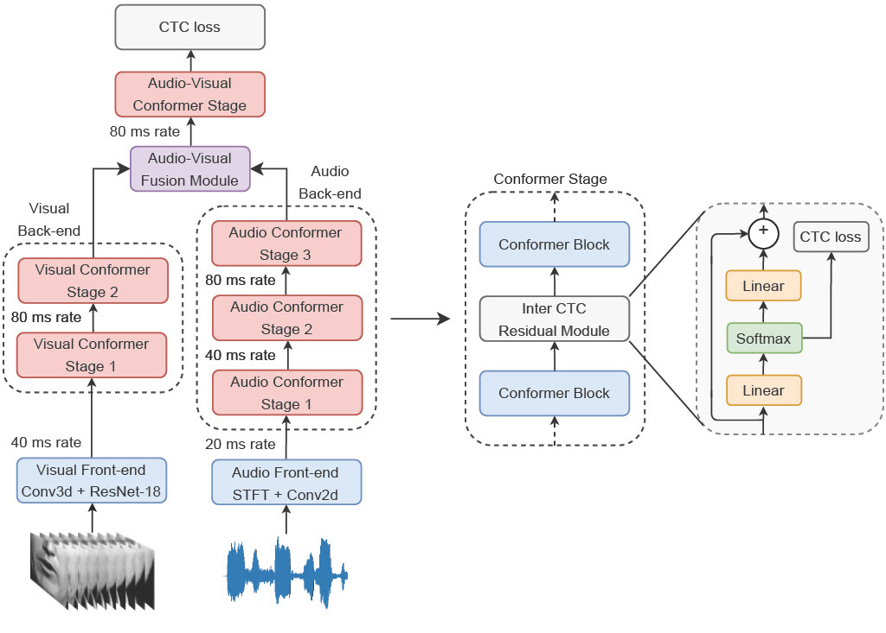

# [WACV 2023] Audio-Visual Efficient Conformer for Robust Speech Recognition

[Maxime Burchi](https://scholar.google.com/citations?user=7S_l2eAAAAAJ), [Radu Timofte](https://scholar.google.com/citations?user=u3MwH5kAAAAJ)

[Computer Vision Lab, CAIDAS, IFI, University of Würzburg](https://www.informatik.uni-wuerzburg.de/computervision/home/)

Official implementation of the Audio-Visual Efficient Conformer (AVEC) for Robust Speech Recognition.

**Audio-Visual Efficient Conformer [Paper](https://openaccess.thecvf.com/content/WACV2023/html/Burchi_Audio-Visual_Efficient_Conformer_for_Robust_Speech_Recognition_WACV_2023_paper.html) |
[Arxiv](https://arxiv.org/abs/2301.01456) |
[Demo Notebook](https://colab.research.google.com/github/burchim/AVEC/blob/master/demo.ipynb) |
[Installation](#Installation) |
[Models](#Models) |
[Contact](#Contact)**

------------------

> End-to-end Automatic Speech Recognition (ASR) systems based on neural networks have seen large improvements in recent years. The availability of large scale hand-labeled datasets and sufficient computing resources made it possible to train powerful deep neural networks, reaching very low Word Error Rate (WER) on academic benchmarks. However, despite impressive performance on clean audio samples, a drop of performance is often observed on noisy speech. In this work, we propose to improve the noise robustness of the recently proposed Efficient Conformer Connectionist Temporal Classification (CTC)-based architecture by processing both audio and visual modalities. We improve previous lip reading methods using an Efficient Conformer back-end on top of a ResNet-18 visual front-end and by adding intermediate CTC losses between blocks. We condition intermediate block features on early predictions using Inter CTC residual modules to relax the conditional independence assumption of CTC-based models. We also replace the Efficient Conformer grouped attention by a more efficient and simpler attention mechanism that we call patch attention. We experiment with publicly available Lip Reading Sentences 2 (LRS2) and Lip Reading Sentences 3 (LRS3) datasets. Our experiments show that using audio and visual modalities allows to better recognize speech in the presence of environmental noise and significantly accelerate training, reaching lower WER with 4 times less training steps. Our Audio-Visual Efficient Conformer (AVEC) model achieves state-of-the-art performance, reaching WER of 2.3% and 1.8% on LRS2 and LRS3 test sets.

## Transcription Demo (Visual-Only, Audio-Only and Audio-Visual)

</img>

## Method
The Audio-Visual Efficient Conformer is composed of 4 main components: An audio encoder, a visual encoder, an audio-visual fusion module and an audio-visual encoder.
The audio and visual encoder are separated into modality specific front-end networks to transform each input modality into temporal sequences. Efficient Conformer back-end networks are used to model local and global temporal relationships. The full model is trained end-to-end using intermediate CTC losses between Conformer blocks in addition of the output CTC layer.



## Installation
Clone GitHub repository and set up environment
```
git clone https://github.com/burchim/AVEC.git && cd AVEC
pip install -r requirements.txt
```

Install [ctcdecode](https://github.com/parlance/ctcdecode) for beam search decoding (optional).
```
git clone --recursive https://github.com/parlance/ctcdecode.git
cd ctcdecode
pip install .
cd ..
```

Install [ibug.face_detection](https://github.com/hhj1897/face_detection) and [ibug.face_alignment](https://github.com/hhj1897/face_alignment) for face detection and alignment (optional). 
```
# ibug.face_detection
git clone https://github.com/hhj1897/face_detection.git
cd face_detection
git lfs pull
pip install -e .
cd ..
```
```
# ibug.face_alignment
git clone https://github.com/hhj1897/face_alignment.git
cd face_alignment
pip install -e .
cd ..
```

Download pretrained model checkpoints and tokenizers.
```
python download_checkpoints_and_tokenizers.py
```

## Download And Prepare Datasets

We used 3 publicly available datasets in this work. The [Lip Reading in the Wild (LRW)](https://www.robots.ox.ac.uk/~vgg/data/lip_reading/lrw1.html) dataset was used for visual pre-training and the [Lip Reading Sentences 2 (LRS2)](https://www.robots.ox.ac.uk/~vgg/data/lip_reading/lrs2.html) and [Lip Reading Sentences 3 (LRS3)](https://www.robots.ox.ac.uk/~vgg/data/lip_reading/lrs3.html) datasets were used for training and evaluation. LRW is an audio-visual word recognition dataset consisting of short video segments containing a single word out of a vocabulary of 500. LRS2 and LRS3 are audio-visual speech recognition datasets composed of 224.1 hours from the BBC television and 438.9 hours from TED and TEDx talks.

```
# You will need to add your datasets username/password before running script
python download_and_prepare_datasets.py
```

## Running an experiment

You can run an experiment by providing a config file using the '--config_file' flag. Training checkpoints and logs will automatically be saved in the callback folder specified in the config file.
```
python main.py --config_file configs/config_file.py
```

## Evaluation

Models can be evaluated by selecting the evaluation mode and by providing a checkpoint to load with the '--checkpoint' flag. The checkpoint must be placed in the config callback folder. 

```
python main.py --config_file configs/config_file.py --checkpoint checkpoint.ckpt --mode evaluation
```

## Options


```
# Args
-c / --config_file           type=str   default="configs/LRS23/AV/EffConfInterCTC.py"      help="Python configuration file containing model hyperparameters"
-m / --mode                  type=str   default="training"                                 help="Mode : training, training, evaluation, swa, pass, eval_time"
-i / --checkpoint            type=str   default=None                                       help="Load model from checkpoint name"
-j / --num_workers           type=int   default=0                                          help="Number of data loading workers"
--cpu                        action="store_true"                                           help="Load model on cpu"
--load_last                  action="store_true"                                           help="Load last model checkpoint"

# Distributed
-d / --distributed           action="store_true"                                           help="Distributed data parallelization"
--parallel                   action="store_true"                                           help="Parallelize model using data parallelization"
--world_size                 type=int   default=torch.cuda.device_count()                  help="Number of available GPUs"
--dist_log                   action="store_true"                                           help="Log each GPU process instead only GPU:0"
--dist_addr                  type=str   default='localhost'                                help="MASTER_ADDR"
--dist_port                  type=str   default='29501'                                    help="MASTER_PORT"
--backend                    type=str   default='nccl'                                     help="backend"

# Training
--steps_per_epoch            type=int   default=None                                       help="Number of steps per epoch"
--saving_period_step         type=int   default=None                                       help="Model saving every 'n' steps"
--saving_period_epoch        type=int   default=1                                          help="Model saving every 'n' epochs"
--log_figure_period_step     type=int   default=None                                       help="Log figure every 'n' steps"
--log_figure_period_epoch    type=int   default=1                                          help="Log figure every 'n' epochs"
--step_log_period            type=int   default=100                                        help="Training step log period"
--no_eval_training           action="store_true"                                           help="Do not evaluate training samples"

# Eval
--eval_period_epoch          type=int   default=1                                          help="Model evaluation every 'n' epochs"
--eval_period_step           type=int   default=None                                       help="Model evaluation every 'n' steps"
--batch_size_eval            type=int   default=None                                       help="Evaluation batch size"
--verbose_eval               type=int   default=0                                          help="Evaluation verbose level"
--eval_steps                 type=int   default=None                                       help="Number of evaluation steps"

# Info
--show_dict                  action="store_true"                                           help="Show model dict summary"
--show_modules               action="store_true"                                           help="Show model named modules"
    
# SWA
--swa_epochs                 nargs="+"  default=None                                       help="Start epoch / end epoch for swa"
--swa_epochs_list            nargs="+"  default=None                                       help="List of checkpoints epochs for swa"
--swa_type                   type=str   default="equal"                                    help="Stochastic weight averaging type (equal/exp)"

# Debug
--detect_anomaly             action="store_true"                                           help="Enable or disable the autograd anomaly detection"
```


## Models

Evaluate Models:
```
./eval_models.sh
```

| LRS Model        		  | Params (M) | Training Datasets | LRS2 test WER (%)| LRS3 test WER (%) | GPUs |
| :-------------------:	|:----------:|:------:|:------:|:------:|:------:|
| [Audio-only Efficient Conformer](https://drive.google.com/drive/folders/1v_xbrTLtTYRK_g_nvFzhfPGbuYjztzcG?usp=sharing) 	| 31.5  | LRS2&3 | 2.4 | 2.0 | 4 x RTX 2080 Ti |
| [Visual-only Efficient Conformer](https://drive.google.com/drive/folders/1LxUmpyrFO3ZbAb9jaO9nk-U3OOfRrOkZ?usp=sharing) 	| 40.9  | LRW, LRS2&3 | 29.8 | 37.5 | 4 x A100 |
| [Audio-visual Efficient Conformer](https://drive.google.com/drive/folders/1W5DR8HZjr6OQDkH9cBbTo61thqPpjXEk?usp=sharing) 	| 61.7 | LRW, LRS2&3 | 2.3 | 1.8 | 4 x A100 |

| Neural LM        		  | Params (M) | Training Datasets | GPUs |
| :-------------------:	|:----------:|:------:|:------:|
| [Transformer LM](https://drive.google.com/drive/folders/1CGlSFsRZpLtMR4xVC1tnZNb15LCq1z5I?usp=sharing) | 86.6 | LibriSpeech LM Corpus, LRS2&3 | 4 x RTX 2080 Ti|

| LRW Model        		  | Params (M) | Training Datasets | GPUs |
| :-------------------:	|:----------:|:------:|:------:|
| [LRW Efficient Conformer](https://drive.google.com/drive/folders/1dqqgRTrQsy9QHefxoMMf4maFyWo12-GB?usp=sharing) | 40.9 | LRW | 4 x RTX 2080 Ti|

## Citation

```
@InProceedings{Burchi_2023_WACV,
    author    = {Burchi, Maxime and Timofte, Radu},
    title     = {Audio-Visual Efficient Conformer for Robust Speech Recognition},
    booktitle = {Proceedings of the IEEE/CVF Winter Conference on Applications of Computer Vision (WACV)},
    month     = {January},
    year      = {2023},
    pages     = {2258-2267}
}
```

## Contact
* Maxime Burchi [@burchim](https://github.com/burchim)
* Email: [maxime.burchi@uni-wuerzburg.de](mailto:maxime.burchi@uni-wuerzburg.de)
